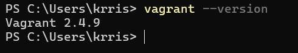
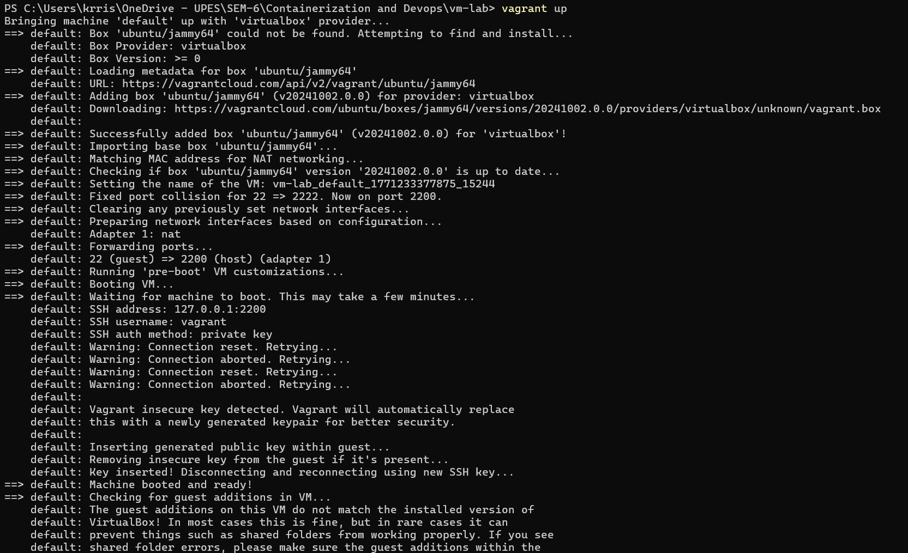
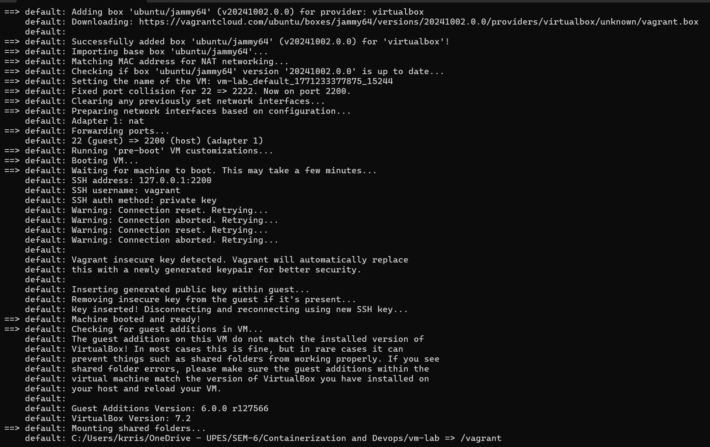
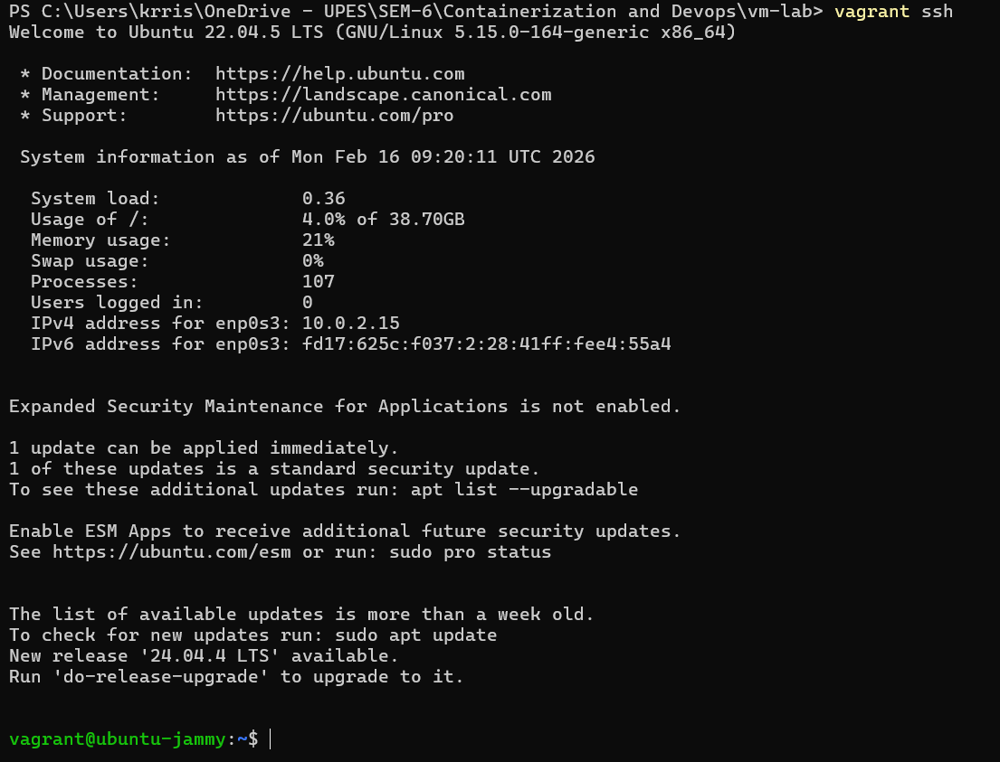
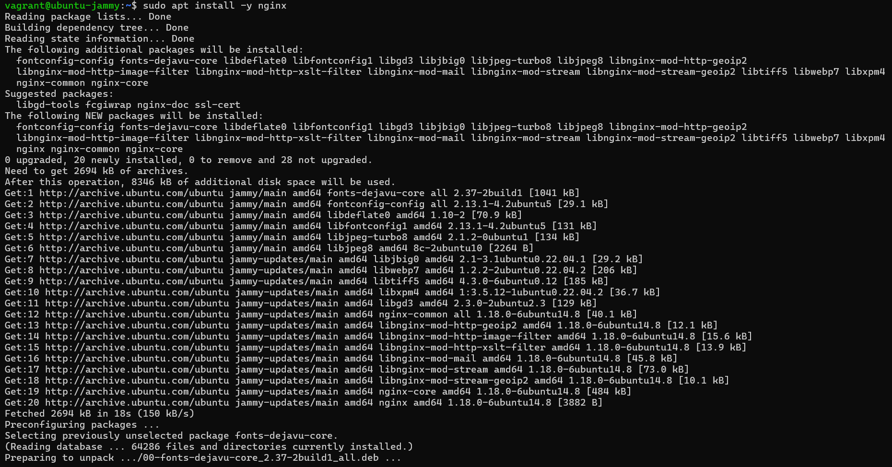
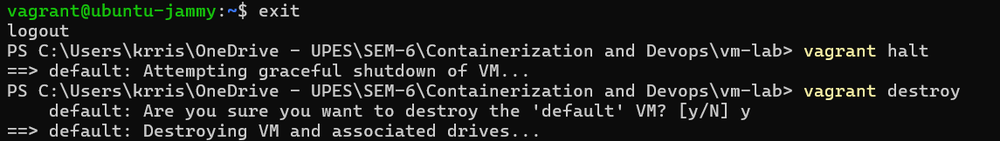
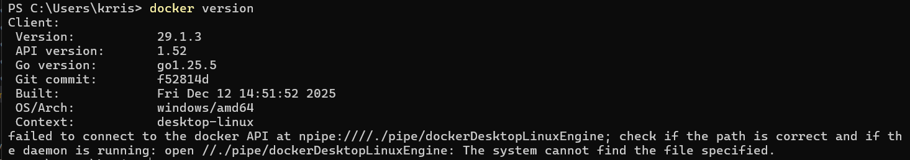
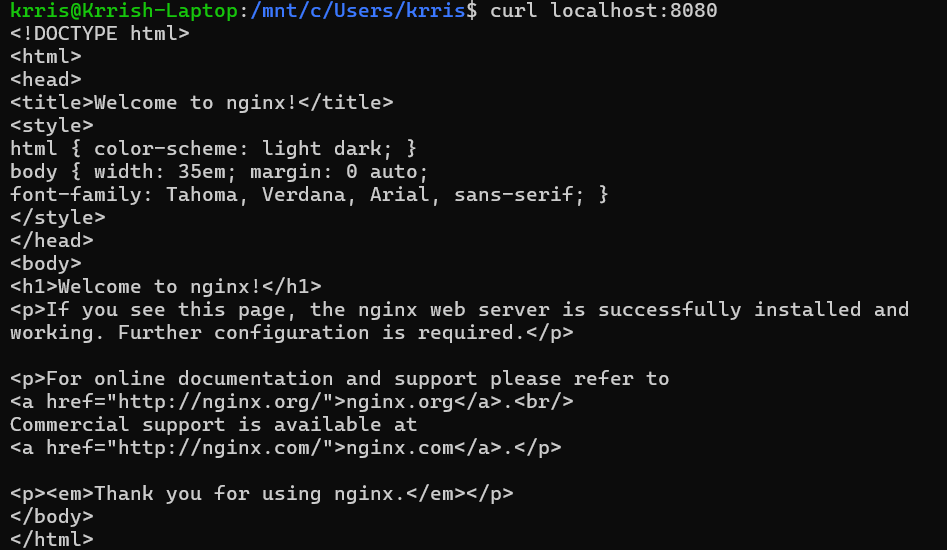
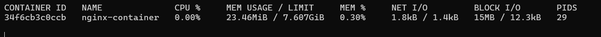

# **Lab 1**

Comparison of Virtual Machines (VMs) and Containers using Ubuntu and Nginx.

---
**Name:** Krrish Batra

**SAP ID:** 500119657

**Batch:** 2

**Specialisation:** Cloud Computing and Virtualization Technology

---

## **Software and Hardware Requirements**

### **Hardware**

* 64-bit system with virtualization support enabled in BIOS
* Minimum 8 GB RAM (4 GB minimum acceptable)
* Internet Connection

### **Software (Windows Host)**

* Oracle VirtualBox
* Vagrant
* Windows Subsystem for Linux (WSL 2)
* Ubuntu (WSL distribution)
* Docker Engine (docker.io)

---

## **Theory**

### **Virtual Machine**

A Virtual Machine emulates a complete physical computer, including its own operating system kernel, hardware drivers, and user space. Each VM runs on top of a hypervisor.

**Characteristics:**

* Full OS per VM
* Higher resource usage
* Strong isolation
* Slower startup time

### **Container**

Containers virtualize at the operating system level. They share the host OS kernel while isolating applications and dependencies in user space.

**Characteristics:**

* Shared kernel
* Lightweight
* Fast startup
* Efficient resource usage

---

## **Experiment Setup – Part A: Virtual Machine (Windows)**

### **Step 1: Install VirtualBox**

1. Download VirtualBox from the official website.
2. Run the installer and keep default options.
3. Restart the system if prompted.


---

### **Step 2: Install Vagrant**

1. Download Vagrant for Windows.
2. Install using default settings.
3. Verify installation:

   ```bash
   vagrant --version
   ```
   


---

### **Step 3: Create Ubuntu VM using Vagrant**

1. Create a new directory:

   ```bash
   mkdir vm-lab
   cd vm-lab
   ```

2. Initialize Vagrant with Ubuntu box:

   ```bash
   vagrant init ubuntu/jammy64
   ```

3. Start the VM:

   ```bash
   vagrant up
   ```

   

   
   
4. Access the VM:

   ```bash
   vagrant ssh
   ```
   
    
---

### **Step 4: Install Nginx inside VM**

```bash
sudo apt update
sudo apt install -y nginx
sudo systemctl start nginx
```


---

### **Step 5: Verify Nginx**

```bash
curl localhost
```



### **Step 6: Stop and Remove VM**

```bash
vagrant halt
vagrant destroy
```


## **Experiment Setup – Part B: Containers using WSL (Windows)**

### **Step 1: Install WSL**

```powershell
wsl --install
```
Reboot the system after installation.

---

### **Step 2: Install Ubuntu on WSL**

```powershell
wsl --install -d Ubuntu
```

---

### **Step 3: Install Docker Engine inside WSL**

```bash
sudo apt update
sudo apt install -y docker.io
sudo systemctl start docker
sudo usermod -aG docker $USER
```



### **Step 4: Run Ubuntu Container with Nginx**

```bash
docker pull ubuntu

docker run -d -p 8080:80 --name nginx-container nginx
```


---

### **Step 5: Verify Nginx in Container**

```bash
curl localhost:8080
```



## **Resource Utilization Observation**

### **VM Observation Commands**

```bash
free -h
htop
systemd-analyze
```


### **Container Observation Commands**

```bash
docker stats
free -h
```
Container Resource Usage




### **Parameters to Compare**

| Parameter    | Virtual Machine | Container |
| ------------ | --------------- | --------- |
| Boot Time    | High            | Very Low  |
| RAM Usage    | High            | Low       |
| CPU Overhead | Higher          | Minimal   |
| Disk Usage   | Larger          | Smaller   |
| Isolation    | Strong          | Moderate  |

## **Result**

The experiment demonstrates that containers are significantly more lightweight and resource-efficient compared to virtual machines, while virtual machines provide stronger isolation and full OS-level abstraction.

Virtual Machine:

* Resource overhead: High
* Isolation: Strong

Container:

* Resource overhead: Minimal
* Isolation: Good

---

## **Conclusion**

Virtual Machines are suitable for full OS isolation and legacy workloads, whereas Containers are ideal for microservices, rapid deployment, and efficient resource utilization.

---

