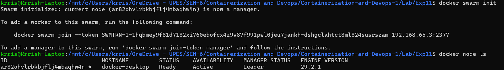
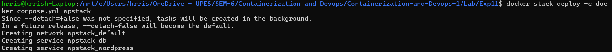
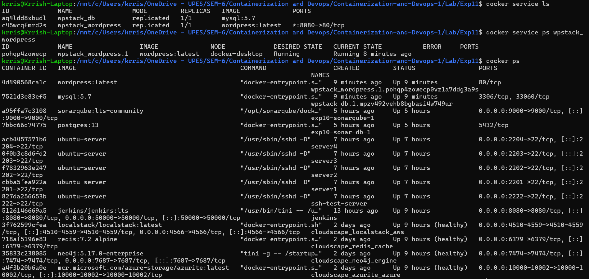
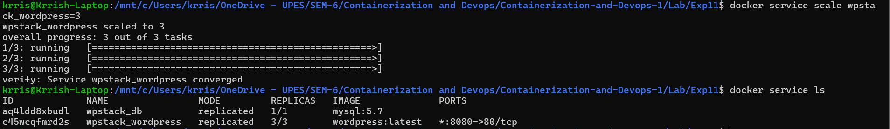
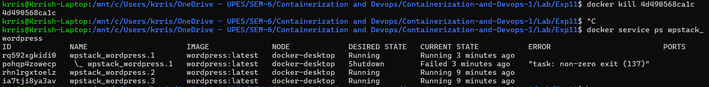
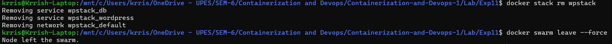

# Lab 11: Container Orchestration using Docker Swarm

## 1. Theory: What is Orchestration?

Orchestration is the automated management of container lifecycles, including scaling, self-healing, and load balancing. While Docker Compose manages multi-container applications on a **single host**, Docker Swarm allows for management across a **cluster of hosts**.

### Key Features of Orchestration:
- **Scaling**: Adjusting the number of running instances.
- **Self-healing**: Automatically restarting or replacing failed containers.
- **Load Balancing**: Distributing incoming traffic across multiple containers.
- **Multi-host Support**: Running a single application across multiple machines.

---

## Practical Task: Moving from Compose to Swarm

### Prerequisites
- Docker Swarm mode enabled.
- A valid `docker-compose.yml` (WordPress + MySQL).

```yaml
version: '3.9'
services:
  db:
    image: mysql:5.7
    environment:
      MYSQL_ROOT_PASSWORD: rootpass
      MYSQL_DATABASE: wordpress
      MYSQL_USER: wpuser
      MYSQL_PASSWORD: wppass
    volumes:
      - db_data:/var/lib/mysql

  wordpress:
    image: wordpress:latest
    depends_on:
      - db
    ports:
      - "8080:80"
    environment:
      WORDPRESS_DB_HOST: db:3306
      WORDPRESS_DB_USER: wpuser
      WORDPRESS_DB_PASSWORD: wppass
      WORDPRESS_DB_NAME: wordpress
    volumes:
      - wp_data:/var/www/html

volumes:
  db_data:
  wp_data:
```

---

## Implementation Steps

### Step 1: Initialize Docker Swarm
```bash
docker swarm init
docker node ls 
```


### Step 2: Deploy as a Stack
In Swarm, we deploy groups of services as a **Stack**:
```bash
docker stack deploy -c docker-compose.yml wpstack
```


### Step 3: Verify the Deployment
Check the status of your services and running tasks:
```bash
docker service ls                # List all services in the stack
docker service ps wpstack_wordpress # View individual container status
docker ps                        # View running containers
```


### Step 4: Scaling the Application
Scale the WordPress service to 3 replicas to handle more traffic:
```bash
docker service scale wpstack_wordpress=3
docker service ls
```


### Step 5: Test Self-Healing
Simulate a failure by killing a running container and watch Swarm recreate it:
```bash
docker kill <container_id>
docker service ps wpstack_wordpress 
```


### Step 6: Cleanup
Remove the stack and all associated services/networks:
```bash
docker stack rm wpstack
docker swarm leave --force  
```


---

## Analysis: Compose vs. Swarm

| Feature | Docker Compose | Docker Swarm |
|---------|----------------|---------------|
| **Scope** | Single host only | Multi-node cluster |
| **Scaling** | Manual/Basic | Built-in Load Balancer |
| **Self-Healing** | No (Manual restart) | Yes (Automatic) |
| **Load Balancing** | No | Internal Mesh (Routing) |
| **Use Case** | Dev / Test | Small Production |

---

## Key Observations

1.  **Compose File Reuse**: The same YAML file used for development in Compose works for production-ready orchestration in Swarm.
2.  **Service Abstraction**: In Swarm, you manage **Services** rather than individual **Containers**.
3.  **Routing Mesh**: Swarm handles port mapping at the cluster level, allowing multiple containers to share the same external port (e.g., 8080) through an internal load balancer.
