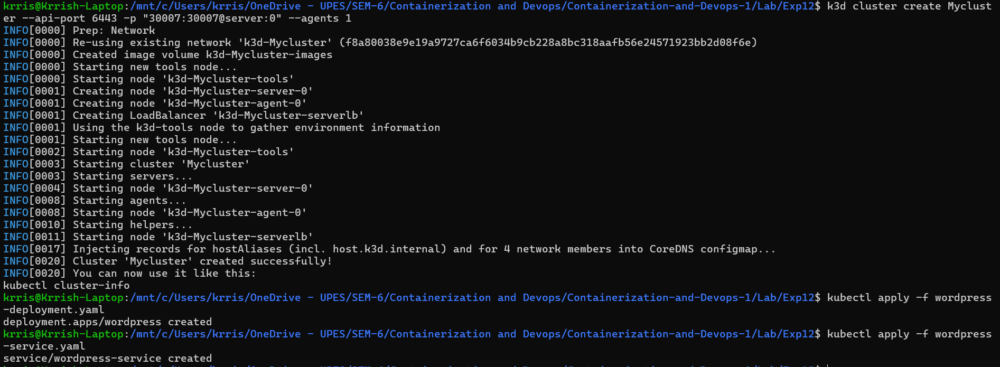
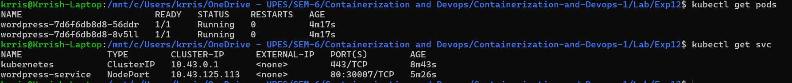
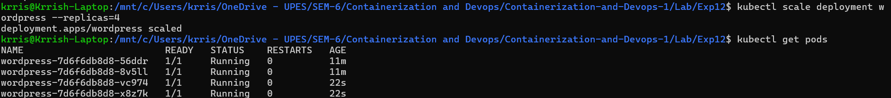
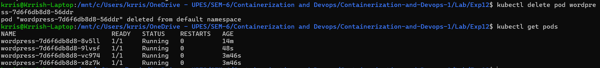

# Lab 12: Container Orchestration using Kubernetes

## Objective
To understand the core concepts of Kubernetes (K8s), learn how it differs from Docker Swarm, and perform basic orchestration tasks including deployment, scaling, and self-healing.

---

## Theory: Why Kubernetes?
Kubernetes is the industry-standard orchestration platform. It provides advanced features for managing containerized applications at scale.

| Feature | Docker Swarm | Kubernetes |
|---------|--------------|-------------|
| **Setup** | Easy to initialize | Complex (Requires more config) |
| **Scaling** | Basic scaling | Advanced Auto-scaling |
| **Ecosystem** | Limited | Massive (Monitoring, Logging, Mesh) |
| **Standard** | Less common in enterprise | Industry Standard |

### Core Concepts Mapping
- **Pod**: The smallest deployable unit (contains one or more containers).
- **Deployment**: Defines the desired state (e.g., image version, replica count).
- **Service**: Exposes the application to the network with a stable IP/DNS.
- **ReplicaSet**: Ensures the specified number of pods are running at all times.

---

## Practical Task: Kubernetes Basics

### Task 1: Create a Deployment
Define a `wordpress-deployment.yaml` to run 2 replicas of WordPress:

```yaml
apiVersion: apps/v1
kind: Deployment
metadata:
  name: wordpress
spec:
  replicas: 2
  selector:
    matchLabels:
      app: wordpress
  template:
    metadata:
      labels:
        app: wordpress
    spec:
      containers:
      - name: wordpress
        image: wordpress:latest
        ports:
        - containerPort: 80
```

**Apply the deployment:**
```bash
kubectl apply -f wordpress-deployment.yaml
```

### Task 2: Expose the Deployment as a Service
Create a `wordpress-service.yaml` to make WordPress accessible:

```yaml
apiVersion: v1
kind: Service
metadata:
  name: wordpress-service
spec:
  type: NodePort
  selector:
    app: wordpress
  ports:
    - port: 80
      targetPort: 80
      nodePort: 30007
```

**Apply the service:**
```bash
kubectl apply -f wordpress-service.yaml
```



---

## Verification and Scaling

### Check Status
```bash
kubectl get pods 
kubectl get svc   
```



### Accessing the App
Open `http://localhost:30007` (or `minikube ip:30007`) in your browser to see the WordPress setup.

### Scaling the Deployment
Increase the capacity to 4 pods:
```bash
kubectl scale deployment wordpress --replicas=4
kubectl get pods  
```



---

## Self-Healing Demonstration
Kubernetes ensures the "Desired State" is maintained. If a pod is deleted, K8s recreates it automatically.

1. **Delete a pod**: `kubectl delete pod <pod-name>`
2. **Observe**: Run `kubectl get pods` immediately and notice a new pod being created to maintain the replica count of 4.



---

## Advanced: Real Cluster Setup (kubeadm)
For production-style clusters on Ubuntu VMs:

1. **Install components**: Install `kubelet`, `kubeadm`, and `kubectl` on all nodes.
2. **Initialize Master**: Run `sudo kubeadm init` on the control plane node.
3. **Network Plugin**: Install a CNI like **Calico**:
   ```bash
   kubectl apply -f https://docs.projectcalico.org/manifests/calico.yaml
   ```
4. **Join Workers**: Run the generated `kubeadm join` command on worker nodes.
5. **Verify**: Run `kubectl get nodes` to see the cluster status.

---

