# **Lab-2**
Docker Installation, Configuration, and Running Images

---
**Name:** Krrish Batra  
**SAP ID:** 500119657  
**Batch:** 2  
**Specialisation:** Cloud Computing and Virtualization Technology
---

## **Objective**

1. Pull Docker images from Docker Hub
2. Run containers using Docker images
3. Manage container lifecycle (start, stop, remove)

---

## **Prerequisites**

Before starting, ensure:

* Docker is installed on your system.
* Basic command-line knowledge.
* Internet connection required.

### **Verify Docker Installation**

Check if Docker is properly installed:

```bash
docker --version
```

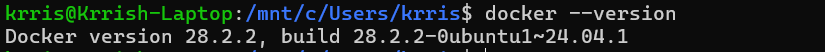


---

## **Procedure**

### **Step 1: Pull Docker Image**

Pull the official Nginx image from Docker Hub:

```bash
docker pull nginx
```

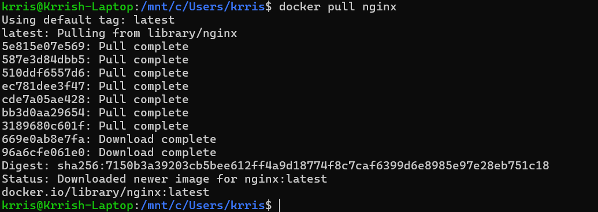

---

Verify the image was downloaded:

```bash
docker images
```
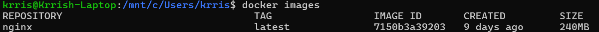


---

### **Step 2: Run Container with Port Mapping**

Run the nginx container in detached mode with port mapping:

```bash
docker run -d -p 8080:80 nginx
```

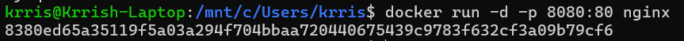


---

### **Step 3: Verify Running Containers**

Check if the container is running:

```bash
docker ps
```

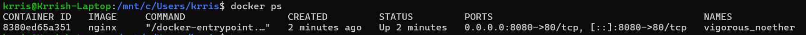


---

### **Access Nginx in Browser**

Open your web browser and navigate to:

```
http://localhost:8080
```

You should see the **"Welcome to nginx!"** page.

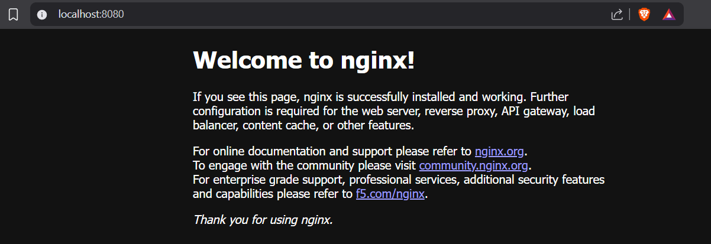


---

Alternatively, test using curl command:

```bash
curl http://localhost:8080
```

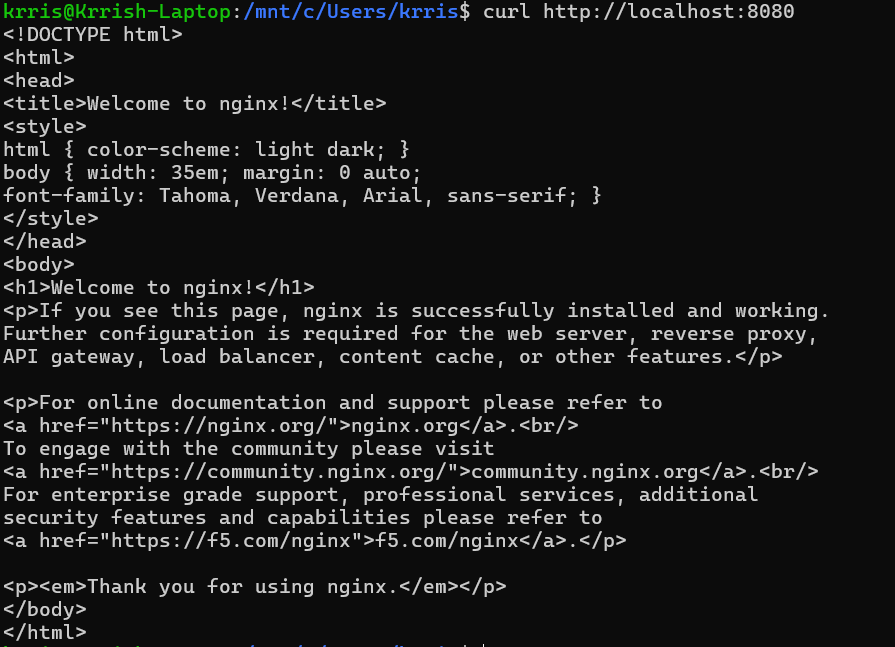

---

### **Step 4: Stop and Remove Container**

#### **4.1: Get Container ID**

```bash
docker ps
```

---

#### **4.2: Stop Container**

Stop the running container:

```bash
docker stop <container_id>
```

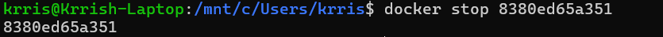


---

Verify the container is stopped:

```bash
docker ps -a
```

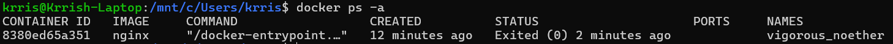


---

#### **4.3: Remove Container**

Remove the stopped container:

```bash
docker rm <container_id>
```

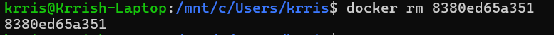


---

Verify container is removed:

```bash
docker ps -a
```

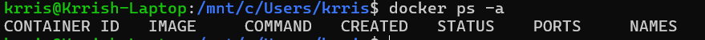

---

### **Step 5:Remove Docker Image**

Remove the nginx image from your system:

```bash
docker rmi nginx
```

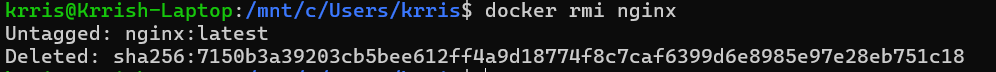

---

Verify the image is removed:

```bash
docker images
```

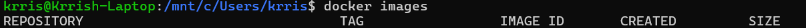

---

## **Additional Docker Commands**

### **Useful Commands for Container Management**

```bash
# List all containers (including stopped)
docker ps -a

# View container logs
docker logs <container_id>

# View container resource usage
docker stats

# Execute command inside running container
docker exec -it <container_id> bash

# Inspect container details
docker inspect <container_id>

# Remove all stopped containers
docker container prune

# Remove all unused images
docker image prune
```

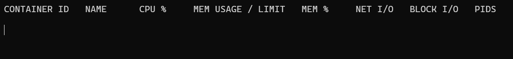

---

## **Observations**

### **Docker Operations Summary**

| Operation | Command | Result |
|-----------|---------|--------|
| Pull Image | `docker pull nginx` | Image downloaded (~187MB) |
| Run Container | `docker run -d -p 8080:80 nginx` | Container started (< 1 second) |
| Verify Container | `docker ps` | Container running on port 8080 |
| Stop Container | `docker stop <id>` | Container stopped gracefully |
| Remove Container | `docker rm <id>` | Container removed from system |
| Remove Image | `docker rmi nginx` | Image deleted from local storage |

---

## **Result**

The experiment successfully demonstrated:

**Docker image successfully pulled** from Docker Hub (nginx, 187MB)  
**Container executed with port mapping** (8080:80)  
**Running containers verified** using `docker ps`  
**Container lifecycle managed** (start, stop, remove)  
**Image removed from system** using `docker rmi`

## **Conclusion**

This experiment demonstrated Docker containerization and basic container lifecycle operations.

### **Key Learnings:**

**Containers are:**
- **Lightweight** 
- **Fast** - Startup in under 1 second
- **Simple** - Easy management through CLI commands
- **Efficient** - Share host kernel, no OS overhead
- **Portable** - Same image runs anywhere Docker is installed

**Use Cases:**
- **Ideal for microservices**
- **Perfect for development** environments
- **Great for CI/CD** pipelines
- **Efficient for production** deployments

