# **Lab-3**
Deploying NGINX Using Different Base Images and Comparing Image Layers.

---
**Name:** Krrish Batra  
**SAP ID:** 500119657  
**Batch:** 2  
**Specialisation:** Cloud Computing and Virtualization Technology

---

## **Objective**

1. Deploy NGINX using Official, Ubuntu-based, and Alpine-based Docker images
2. Understand Docker image layers and size differences
3. Compare performance, security, and use-cases of each approach

---

## **Prerequisites**

Before starting, ensure:

* Docker is installed and running on your system.
* Basic knowledge of `docker run`, `Dockerfile`, and port mapping.
* Linux command basics.

### **Verify Docker Installation**

Check if Docker is properly installed:

```bash
docker --version
```

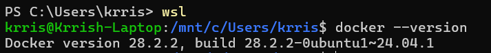

---

## **Procedure**

### **Step 1: Deploy NGINX Using Official Image**

Pull the official NGINX image from Docker Hub:

```bash
docker pull nginx:latest
```

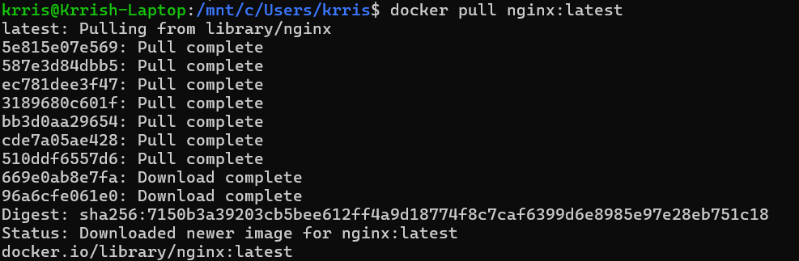

---

Run the container in detached mode with port mapping:

```bash
docker run -d --name nginx-official -p 8080:80 nginx
```

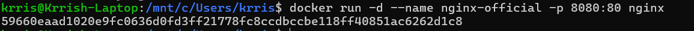
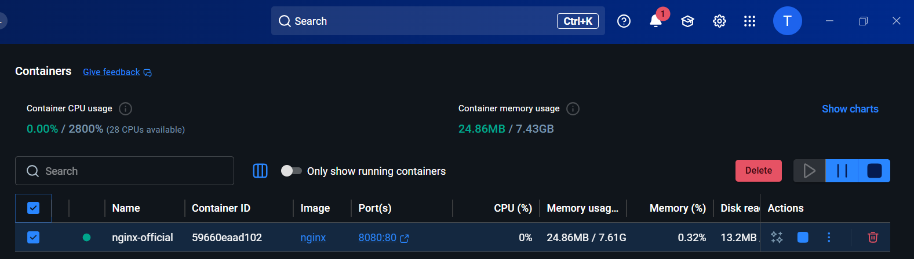

---

Verify the container is running and test with curl:

```bash
docker ps
curl http://localhost:8080
```

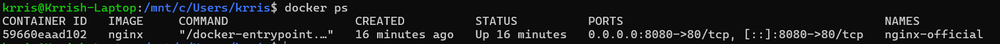
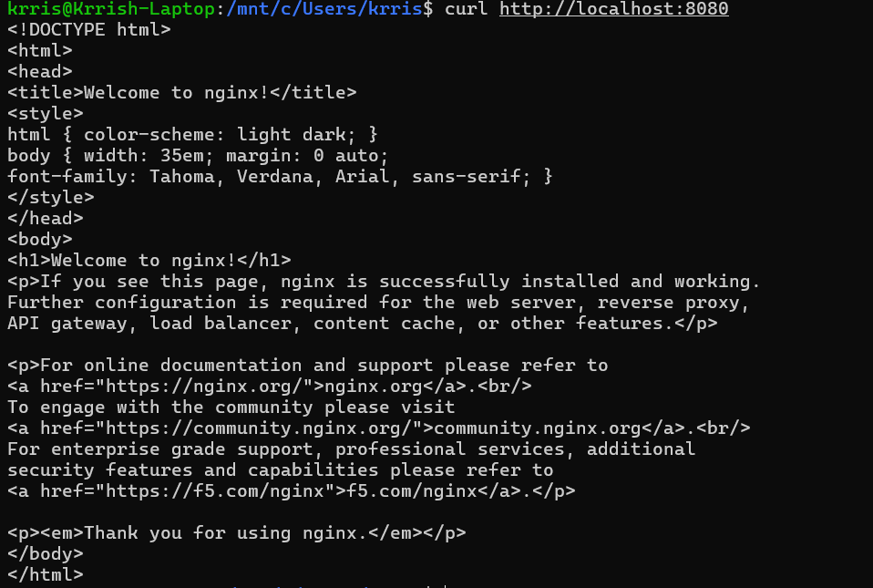

---

Check the image size:

```bash
docker images nginx
```

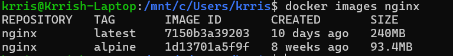

---

### **Step 2: Deploy NGINX Using Ubuntu Base Image**

#### **2.1: Create Dockerfile**

Create a new directory and write the Dockerfile:

```bash
mkdir nginx-ubuntu && cd nginx-ubuntu
nano Dockerfile
```

```Dockerfile
FROM ubuntu:22.04

RUN apt-get update && \
    apt-get install -y nginx && \
    apt-get clean && \
    rm -rf /var/lib/apt/lists/*

EXPOSE 80

CMD ["nginx", "-g", "daemon off;"]
```

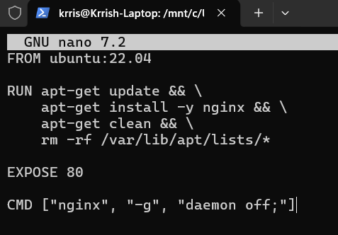

---

#### **2.2: Build the Image**

```bash
docker build -t nginx-ubuntu .
```

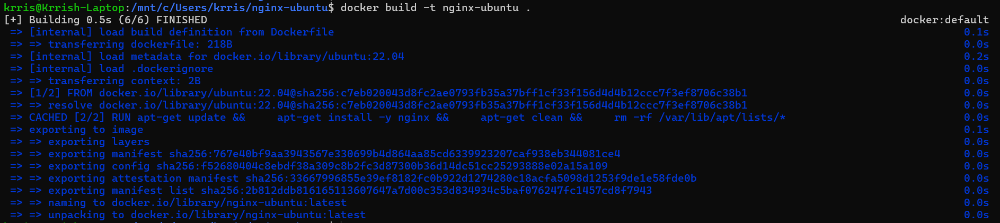

---

#### **2.3: Run the Container**

```bash
docker run -d --name nginx-ubuntu -p 8081:80 nginx-ubuntu
```

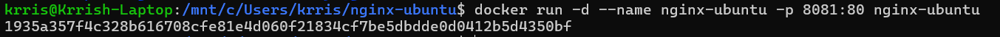

---

Verify and check image size:

```bash
docker ps
docker images nginx-ubuntu
```

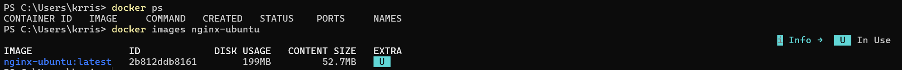

---

### **Step 3: Deploy NGINX Using Alpine Base Image**

#### **3.1: Create Dockerfile**

Create a new directory and write the Dockerfile:

```bash
mkdir nginx-alpine && cd nginx-alpine
nano Dockerfile
```

```Dockerfile
FROM alpine:latest

RUN apk add --no-cache nginx

EXPOSE 80

CMD ["nginx", "-g", "daemon off;"]
```

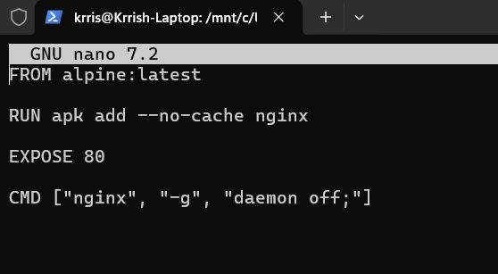

---

#### **3.2: Build the Image**

```bash
docker build -t nginx-alpine .
```

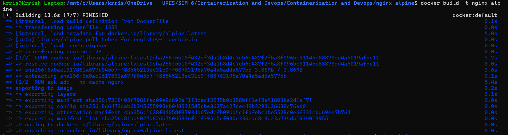

---

#### **3.3: Run the Container**

```bash
docker run -d --name nginx-alpine -p 8082:80 nginx-alpine
```

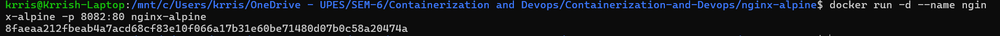

---

Verify and check image size:

```bash
docker ps
docker images nginx-alpine
```

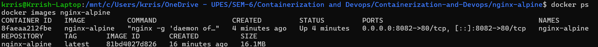

---

### **Step 4: Compare All Images**

List and compare all NGINX images side by side:

```bash
docker images | grep nginx
```

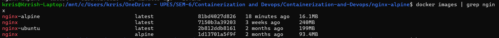

---

### **Step 5: Inspect Image Layers**

Inspect layer history for each image:

```bash
docker history nginx
docker history nginx-ubuntu
docker history nginx-alpine
```

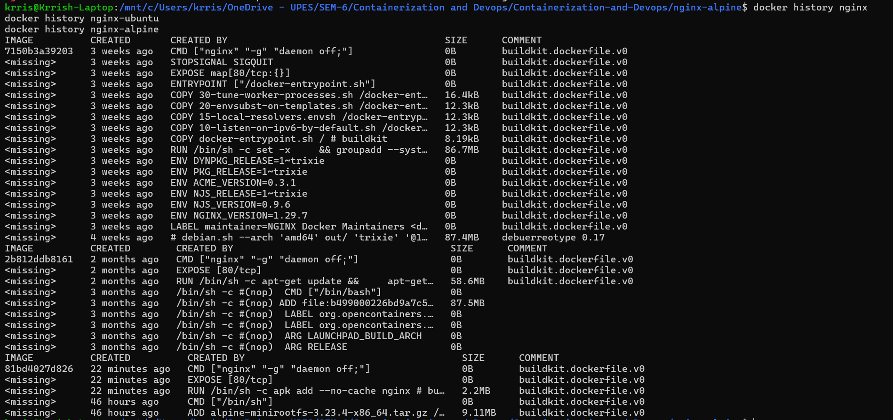

---

### **Step 6: Serve a Custom HTML Page**

Create a custom HTML file and serve it using the official NGINX image:

```bash
mkdir html
echo "<h1>Hello from Docker NGINX</h1>" > html/index.html
```

Run with volume mount:

```bash
docker run -d \
  -p 8083:80 \
  -v $(pwd)/html:/usr/share/nginx/html \
  nginx
```

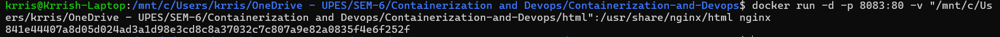

---

Verify in browser or via curl:

```bash
curl http://localhost:8083
```

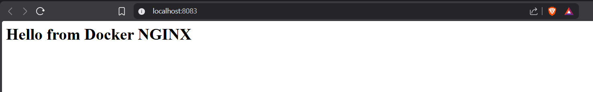

---

## **Additional Docker Commands**

### **Useful Commands for Image and Layer Management**

```bash
# List all running containers
docker ps

# List all images with sizes
docker images

# Inspect full image metadata
docker inspect nginx

# View layer-by-layer history
docker history <image_name>

# Remove a specific container
docker rm <container_id>

# Remove a specific image
docker rmi <image_name>

# Remove all stopped containers
docker container prune

# Remove all unused images
docker image prune

# View real-time resource usage
docker stats
```


---

## **Observations**

### **Image Size and Layer Comparison**

| Image Type     | Approximate Size | Layers | Startup Time |
|----------------|-----------------|--------|--------------|
| `nginx:latest` | ~140 MB         | Medium | Fast         |
| `nginx-ubuntu` | ~220+ MB        | Many   | Slow         |
| `nginx-alpine` | ~25–30 MB       | Few    | Very Fast    |

### **Feature Comparison**

| Feature          | Official NGINX | Ubuntu + NGINX | Alpine + NGINX |
|------------------|----------------|----------------|----------------|
| Image Size       | Medium         | Large          | Very Small     |
| Ease of Use      | Very Easy      | Medium         | Medium         |
| Startup Time     | Fast           | Slow           | Very Fast      |
| Debugging Tools  | Limited        | Excellent      | Minimal        |
| Security Surface | Medium         | Large          | Small          |
| Production Ready | Yes            | Rarely         | Yes            |

---

## **Result**

The experiment successfully demonstrated:

**Official NGINX image deployed** from Docker Hub (~140 MB, fastest setup)  
**Ubuntu-based NGINX image built** using custom Dockerfile (~220+ MB, most layers)  
**Alpine-based NGINX image built** using custom Dockerfile (~25–30 MB, fewest layers)  
**All three containers verified** running simultaneously on ports 8080, 8081, 8082  
**Custom HTML page served** successfully using volume mounting  
**Image layers inspected** and compared using `docker history`

---

## **Conclusion**

This experiment demonstrated the impact of base image selection on Docker image size, layer count, security surface, and production suitability.

### **Key Learnings:**

**Base image choice matters:**
- **Official Image** — Pre-optimized, reliable, best for standard production use
- **Ubuntu Image** — Largest size, rich toolset, suited for debugging and learning
- **Alpine Image** — Smallest size, minimal attack surface, ideal for microservices and CI/CD

**NGINX in containers is:**
- **Lightweight** — Alpine variant under 30 MB
- **Versatile** — Works as web server, reverse proxy, and load balancer
- **Fast** — Container startup in under 1 second
- **Portable** — Same image runs anywhere Docker is installed

**Use Cases:**
- **Official image** — Standard web hosting and reverse proxy
- **Ubuntu image** — Development, learning, and heavy debugging
- **Alpine image** — Kubernetes workloads, CI/CD pipelines, microservices