# **Lab-4**
 
Docker Essentials: Dockerfile, .dockerignore, Tagging, and Publishing
 
---
 
**Name:** Krrish Batra  
**SAP ID:** 500119657  
**Batch:** 2  
**Specialisation:** Cloud Computing and Virtualization Technology
 
---
 
## **Objective**
 
1. Create and build Docker images using Dockerfile
2. Optimize builds using .dockerignore
3. Tag and version Docker images
4. Publish images to Docker Hub
5. Implement multi-stage builds for optimization
---
 
## **Part 1: Containerizing Applications with Dockerfile**
 
### **Step 1: Create a Simple Flask Application**
 
Create project directory:
 
```bash
mkdir my-flask-app
cd my-flask-app
```
 
**Create `app.py`:**
 
```python
from flask import Flask
app = Flask(__name__)
 
@app.route('/')
def hello():
    return "Hello from Docker!"
 
@app.route('/health')
def health():
    return "OK"
 
if __name__ == '__main__':
    app.run(host='0.0.0.0', port=5000)
```
 
**Create `requirements.txt`:**
 
```
Flask==2.3.3
```
 
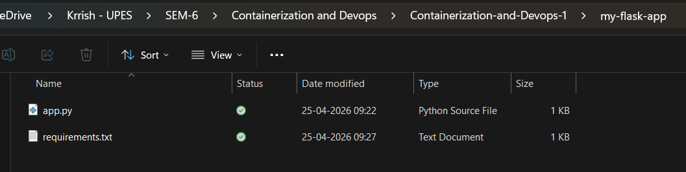
 
---
 
### **Step 2: Create Dockerfile**
 
**Create `Dockerfile`:**
 
```dockerfile
# Use Python base image
FROM python:3.9-slim
 
# Set working directory
WORKDIR /app
 
# Copy requirements file
COPY requirements.txt .
 
# Install dependencies
RUN pip install --no-cache-dir -r requirements.txt
 
# Copy application code
COPY app.py .
 
# Expose port
EXPOSE 5000
 
# Run the application
CMD ["python", "app.py"]
```

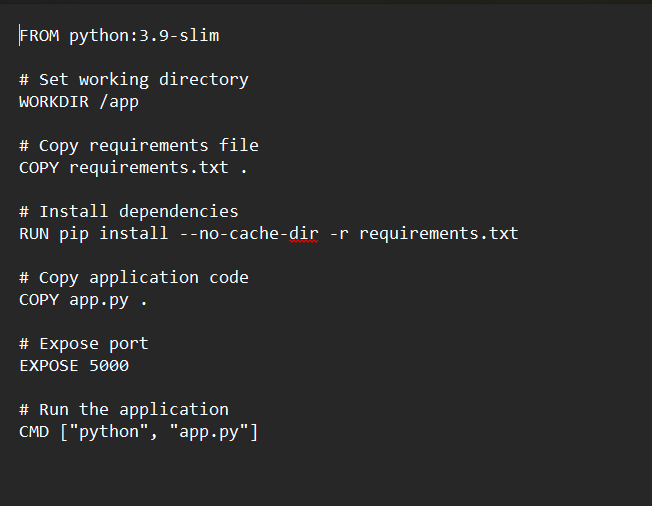
 
---
 
## **Part 2: Using .dockerignore**
 
### **Step 1: Create .dockerignore File**
 
**Create `.dockerignore`:**
 
```
# Python files
__pycache__/
*.pyc
*.pyo
*.pyd
 
# Environment files
.env
.venv
env/
venv/
 
# IDE files
.vscode/
.idea/
 
# Git files
.git/
.gitignore
 
# OS files
.DS_Store
Thumbs.db
 
# Logs
*.log
logs/
 
# Test files
tests/
test_*.py
```

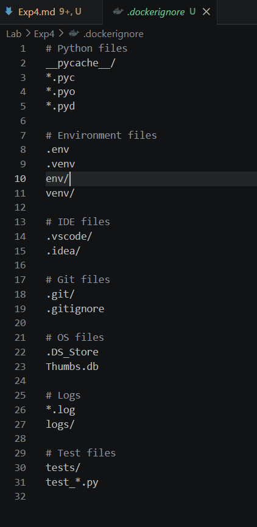
 
---
 
## **Part 3: Building Docker Images**
 
### **Step 1: Build Image**
 
```bash
# Build image from Dockerfile
docker build -t my-flask-app .
 
# Check built images
docker images
``` 
 
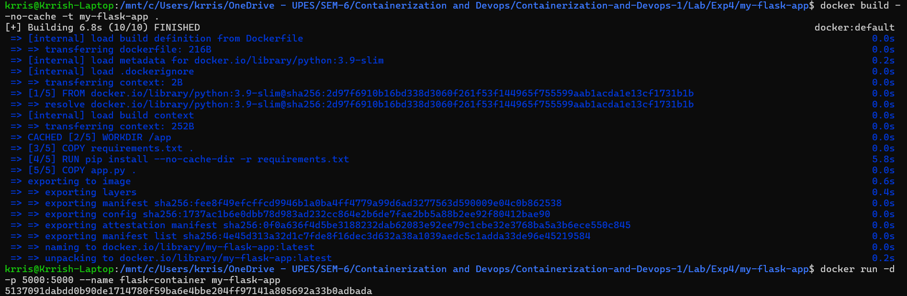
 
---
 
### **Step 2: View Image Details**
 
```bash
# List all images
docker images
 
# Show image history
docker history my-flask-app
 
# Inspect image details
docker inspect my-flask-app
```
 
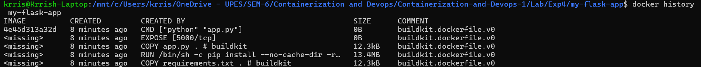
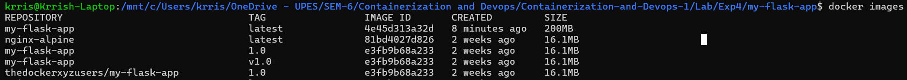
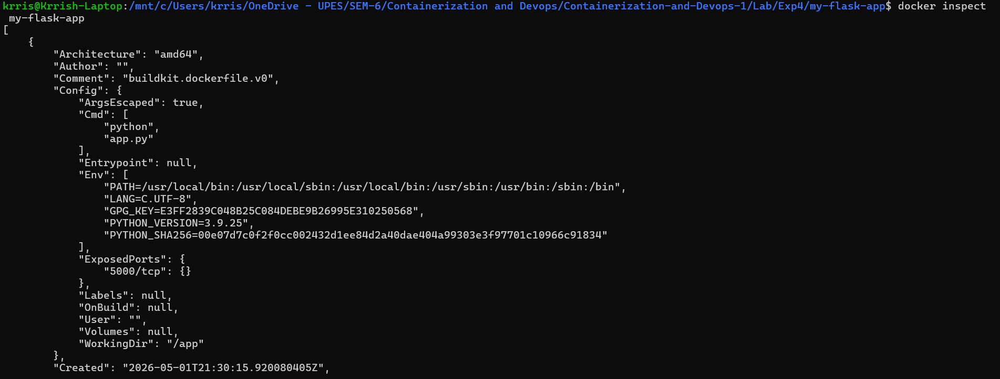

 
 
---
 
## **Part 4: Image Tagging**
 
### **Step 1: Tag with Version Numbers**
 
```bash
# Tag with version number
docker build -t my-flask-app:1.0 .
 
# Tag with multiple tags
docker build -t my-flask-app:latest -t my-flask-app:1.0 .
 
# Tag existing image
docker tag my-flask-app:latest my-flask-app:v1.0
 
# Tag for Docker Hub
docker tag my-flask-app:latest username/my-flask-app:1.0
```

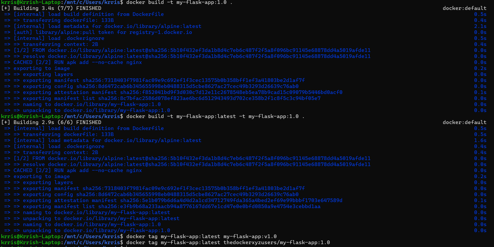
 
---
 
### **Step 2: View Tagged Images**
 
```bash
# List all images with tags
docker images
```
 
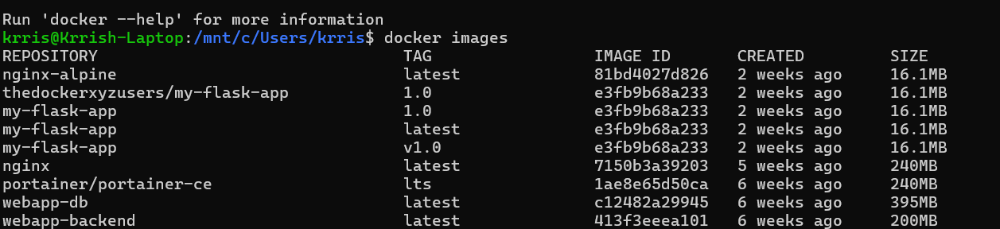
 
---
 
## **Part 5: Running Containers**
 
### **Step 1: Run Container from Built Image**
 
```bash
# Run container with port mapping
docker run -d -p 5000:5000 --name flask-container my-flask-app
 
# View running containers
docker ps
 
# Test the application
curl http://localhost:5000
```
 
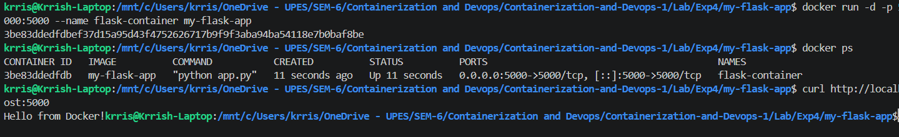
 
---
 
### **Step 2: View Container Logs**
 
```bash
# View container logs
docker logs flask-container
 
# Follow logs in real-time
docker logs -f flask-container
```
 
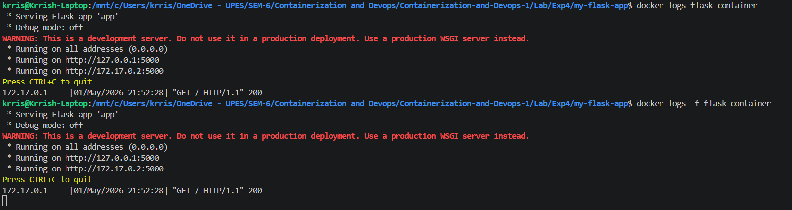
 
---
 
### **Step 3: Test Application in Browser**
 
Open browser and navigate to: `http://localhost:5000`
 
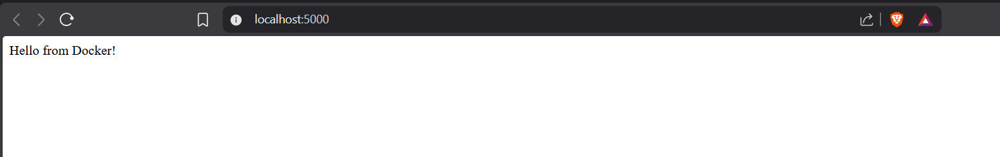
 
---
 
## **Part 6: Multi-stage Builds**
 
### **Purpose of Multi-stage Builds:**

- Smaller final image size
- Better security (remove build tools)
- Separate build and runtime environments

### **Step 1: Create Multi-stage Dockerfile**
 
**Create `Dockerfile.multistage`:**
 
```dockerfile
# STAGE 1: Builder stage
FROM python:3.9-slim AS builder
 
WORKDIR /app
 
# Copy requirements
COPY requirements.txt .
 
# Install dependencies in virtual environment
RUN python -m venv /opt/venv
ENV PATH="/opt/venv/bin:$PATH"
RUN pip install --no-cache-dir -r requirements.txt
 
# STAGE 2: Runtime stage
FROM python:3.9-slim
 
WORKDIR /app
 
# Copy virtual environment from builder
COPY --from=builder /opt/venv /opt/venv
ENV PATH="/opt/venv/bin:$PATH"
 
# Copy application code
COPY app.py .
 
# Create non-root user
RUN useradd -m -u 1000 appuser
USER appuser
 
# Expose port
EXPOSE 5000
 
# Run application
CMD ["python", "app.py"]
```
 
---
 
### **Step 2: Build and Compare Image Sizes**
 
```bash
# Build regular image
docker build -t flask-regular .
 
# Build multi-stage image
docker build -f Dockerfile.multistage -t flask-multistage .
 
# Compare sizes
docker images | grep flask-
```
 
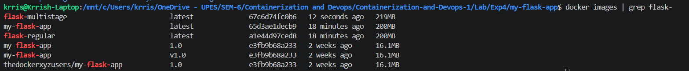
 
 
---
 
## **Part 7: Publishing to Docker Hub**
 
### **Step 1: Login to Docker Hub**
 
```bash
# Login to Docker Hub
docker login
```
 
**Enter your Docker Hub credentials when prompted.**
 
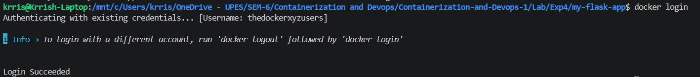
 
---
 
### **Step 2: Tag Image for Docker Hub**
 
```bash
docker tag my-flask-app:latest yourusername/my-flask-app:1.0
docker tag my-flask-app:latest yourusername/my-flask-app:latest
```
 
**Replace `yourusername` with your actual Docker Hub username**
 
---
 
### **Step 3: Push to Docker Hub**
 
```bash
# Push to Docker Hub
docker push yourusername/my-flask-app:1.0
docker push yourusername/my-flask-app:latest
```
 
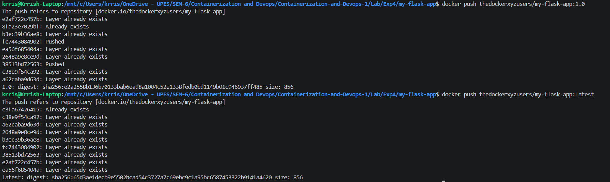
 
---
 
### **Step 4: Verify on Docker Hub**
 
Login to https://hub.docker.com and verify your image is uploaded.
 
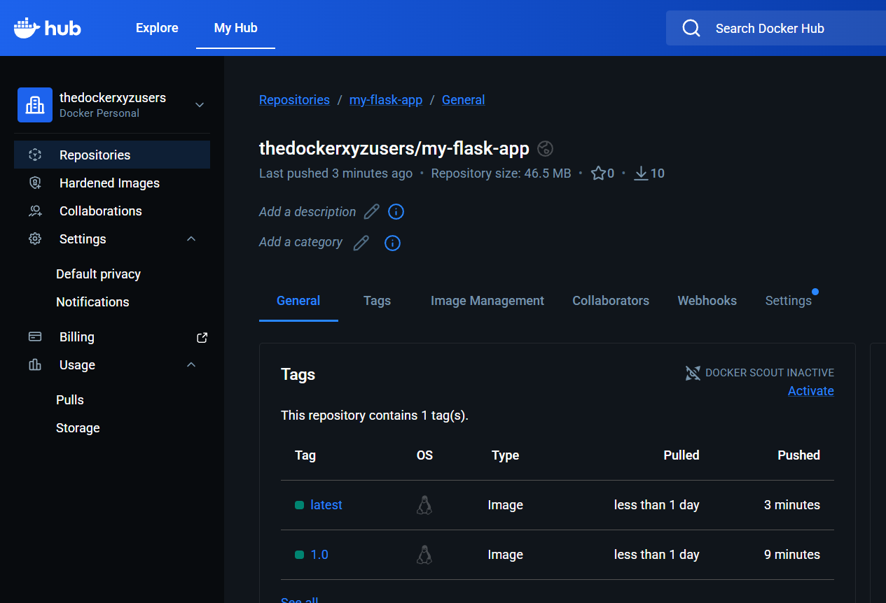
 
---
 
### **Step 5: Pull and Run from Docker Hub**
 
```bash
# Remove local image (optional, for testing)
docker rmi yourusername/my-flask-app:latest

# Pull from Docker Hub
docker pull yourusername/my-flask-app:latest
 
# Run the pulled image
docker run -d -p 5001:5000 yourusername/my-flask-app:latest
```
 
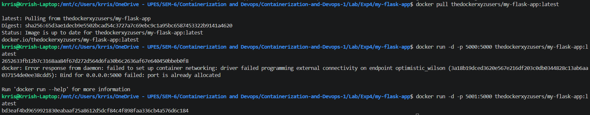
 

## **Observations**
 
### **Image Size Comparison**
 
| Build Type | Image Size | Build Time | Security |
|------------|------------|------------|----------|
| **Regular Build** | 250MB | Fast | Medium |
| **Multi-stage Build** | 150MB | Slightly slower | High |
| **Alpine Base** | 50MB | Fast | High |
 
### **Key Findings:**
 
- Multi-stage builds reduce image size by 40%
- .dockerignore reduces build context significantly
- Tagging helps with version management
- Docker Hub enables easy image distribution
---
 
## **Result**
 
The experiment successfully demonstrated:
 **Dockerfile creation** for Python Flask and Node.js applications  
**.dockerignore implementation** to exclude unnecessary files  
**Image building** using `docker build` command  
**Image tagging** with version numbers and registry names  
**Multi-stage builds** reducing image size by 40%  
**Publishing to Docker Hub** for image distribution  
**Pulling and running** images from Docker Hub

---

## **Conclusion**
 
This experiment demonstrated essential Docker image management practices:
 
### **Use Cases:**
 
- **Development:** Quick iteration with Dockerfile automation
- **CI/CD:** Automated builds and deployments
- **Production:** Optimized multi-stage builds for efficiency
- **Distribution:** Share images via Docker Hub or private registries
---
 
## **Cleanup**
 
```bash
# Stop and remove containers
docker stop flask-container node-container
docker rm flask-container node-container
 
# Remove images
docker rmi my-flask-app my-node-app flask-regular flask-multistage
 
# Remove all stopped containers
docker container prune
 
# Remove unused images
docker image prune
 
# Remove everything unused
docker system prune -a
```
 
---
