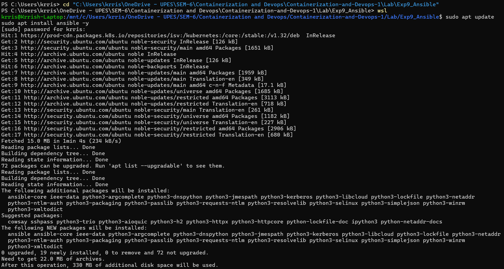
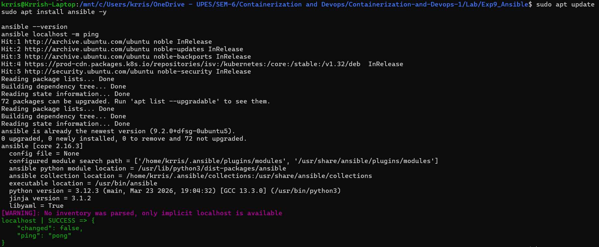
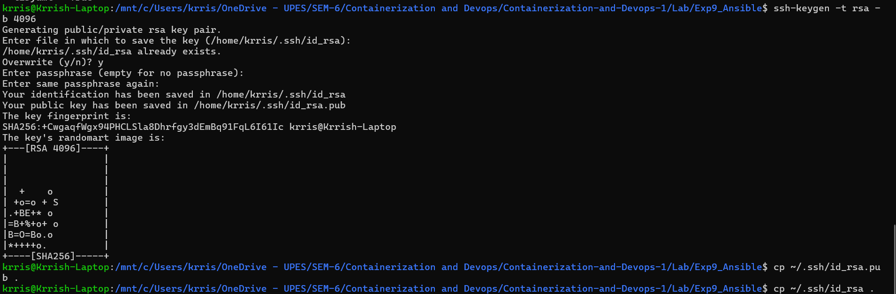
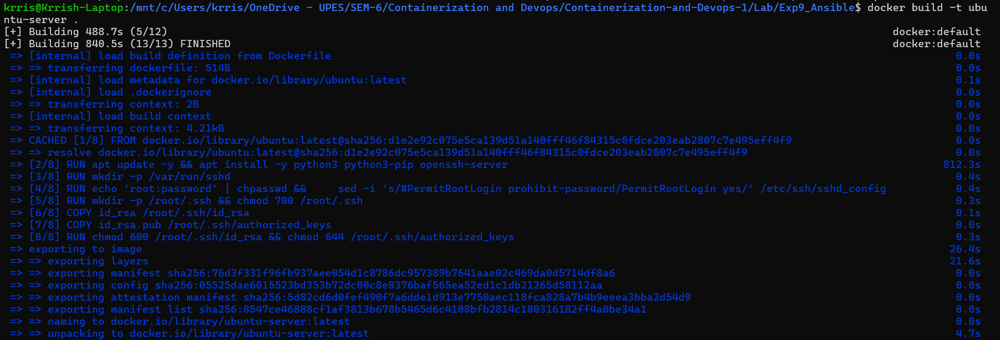
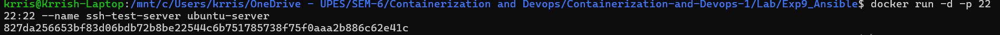
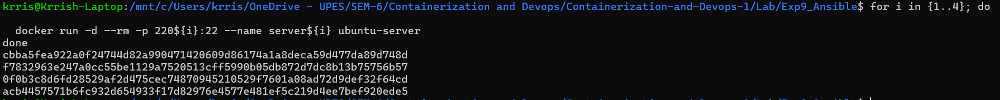
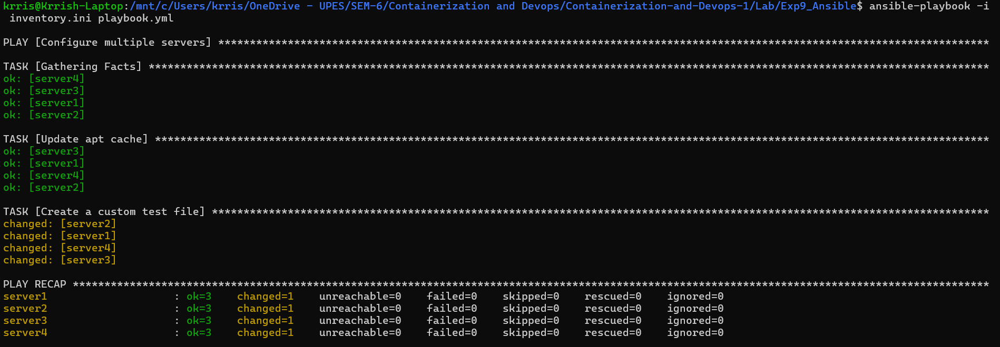
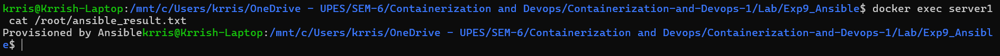

# Lab 9: Infrastructure Automation using Ansible

## Theory

### What is Ansible?
Ansible is an open-source automation tool for configuration management, application deployment, and orchestration.
- **Agentless Architecture**: Uses SSH for Linux.
- **Idempotency**: Predictable system states.
- **Declarative Syntax**: Describes the desired state.

---

## PART A – PRACTICAL TASK

### Ansible Installation on Windows (via WSL)

#### Step 1: Install Ansible
```bash
sudo apt update
sudo apt install ansible -y
```


#### Step 2: Verify Installation
```bash
ansible --version
ansible localhost -m ping
```


---

## Ansible Demo with Docker Containers

### Step 1: Create SSH Key Pair in WSL
```bash
ssh-keygen -t rsa -b 4096
cp ~/.ssh/id_rsa.pub .
cp ~/.ssh/id_rsa .
```


### Step 2: Create Dockerfile for SSH Server
```dockerfile
FROM ubuntu
RUN apt update -y && apt install -y python3 python3-pip openssh-server
RUN mkdir -p /var/run/sshd
RUN echo 'root:password' | chpasswd && \
    sed -i 's/#PermitRootLogin prohibit-password/PermitRootLogin yes/' /etc/ssh/sshd_config
RUN mkdir -p /root/.ssh && chmod 700 /root/.ssh
COPY id_rsa /root/.ssh/id_rsa
COPY id_rsa.pub /root/.ssh/authorized_keys
RUN chmod 600 /root/.ssh/id_rsa && chmod 644 /root/.ssh/authorized_keys
EXPOSE 22
CMD ["/usr/sbin/sshd", "-D"]
```

### Step 3: Build and Run
```bash
docker build -t ubuntu-server .
docker run -d -p 2222:22 --name ssh-test-server ubuntu-server
```



---

## Multi-Container Ansible Exercise

### Step 1: Start 4 Test Servers
```bash
for i in {1..4}; do
  docker run -d --rm -p 220${i}:22 --name server${i} ubuntu-server
done
```


### Step 2: Run Playbook (`playbook.yml`)
```yaml
---
- name: Configure multiple servers
  hosts: servers
  become: yes
  tasks:
    - name: Update apt cache
      apt:
        update_cache: yes
    - name: Create a custom test file
      copy:
        dest: /root/ansible_result.txt
        content: "Provisioned by Ansible"
```
**Execute**: `ansible-playbook -i inventory.ini playbook.yml`


### Step 3: Verify Provisioning
```bash
docker exec server1 cat /root/ansible_result.txt
```


---

## The Need for Ansible

- **Scalability**: Manage hundreds of servers at once.
- **Consistency**: Identical configurations.
- **Efficiency**: Automates repetitive tasks.
- **IaC**: Version-controlled configuration.

---

## Conclusion
This experiment demonstrated the power of Ansible for infrastructure automation, covering agentless configuration, inventory management, and declarative YAML playbooks.

---
